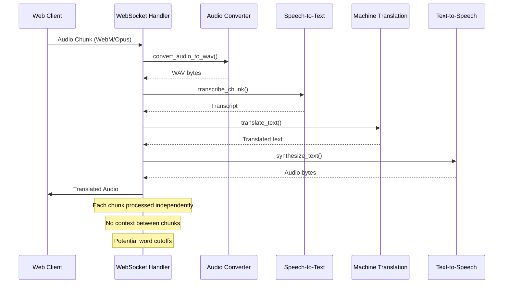
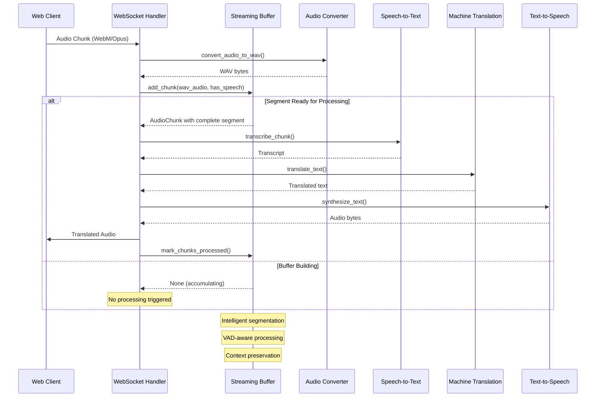
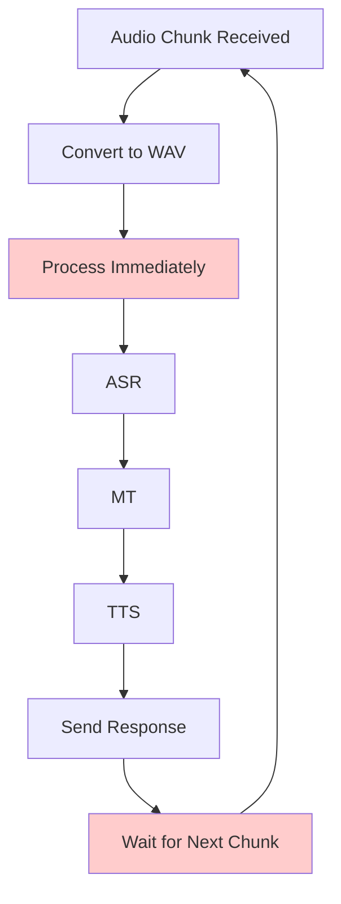
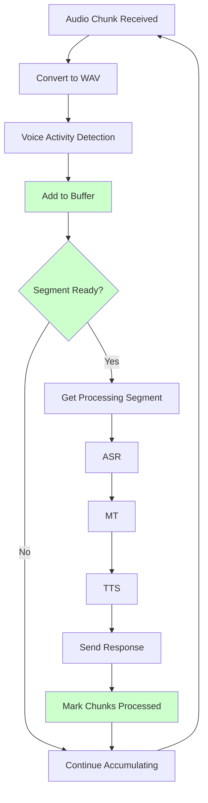

# Streaming Buffer Integration Guide

## Overview

This guide explains how to integrate the `StreamingAudioBuffer` module with the existing WebSocket translation pipeline to enable intelligent audio segmentation and improved real-time processing performance.

## Current System Architecture (Without Streaming Buffer)



### Current System Issues

1. **No Context Between Chunks**: Each audio chunk is processed independently, leading to potential word cutoffs
2. **Inefficient Processing**: Every chunk triggers the full pipeline regardless of speech content
3. **No VAD Intelligence**: Silent chunks still go through ASR processing
4. **Latency Inconsistency**: Processing time varies dramatically between chunks

## New System Architecture (With Streaming Buffer)



## Integration Steps

### Step 1: Update WebSocket Handler Dependencies

Add the streaming buffer import to `app/ws.py`:

```python
from app.streaming_buffer import StreamingAudioBuffer, create_optimized_buffer
```

### Step 2: Initialize Buffer Per Session

Modify the WebSocket endpoint to maintain a buffer per session:

```python
@router.websocket("/ws/translate")
async def websocket_translate(ws: WebSocket):
    await ws.accept()
    
    # Initialize streaming buffer for this session
    audio_buffer = create_optimized_buffer()
    
    # Default configuration
    source_lang = "auto"
    target_lang = "en"
    
    # ... rest of the function
```

### Step 3: Replace Direct Processing with Buffer Integration

Replace the current audio processing logic:

```python
# OLD: Direct processing
elif message["type"] == "websocket.receive" and "bytes" in message:
    try:
        audio_data = message["bytes"]
        if len(audio_data) > 0:
            # Convert to WAV
            wav_audio = convert_audio_to_wav(audio_data, input_format="webm")
            
            # Process immediately
            translated_audio, pipeline_info = await process_audio_pipeline(
                wav_audio, source_lang, target_lang
            )
```

**NEW: Buffer-integrated processing**

```python
elif message["type"] == "websocket.receive" and "bytes" in message:
    try:
        audio_data = message["bytes"]
        if len(audio_data) > 0:
            # Convert to WAV
            wav_audio = convert_audio_to_wav(audio_data, input_format="webm")
            
            # Add to streaming buffer with basic VAD
            has_speech = detect_speech_activity(wav_audio)  # You'll need to implement this
            audio_buffer.add_chunk(wav_audio, has_speech)
            
            # Check if we have a complete segment ready
            processing_segment = audio_buffer.get_processing_segment()
            
            if processing_segment:
                # Process the complete segment
                translated_audio, pipeline_info = await process_audio_pipeline(
                    processing_segment.audio_data, source_lang, target_lang
                )
                
                if pipeline_info["success"] and translated_audio:
                    # Mark chunks as processed
                    audio_buffer.mark_chunks_processed(processing_segment.chunks)
                    
                    # Send translated audio
                    await ws.send_bytes(translated_audio)
                else:
                    # Handle pipeline error (same as before)
                    await ws.send_text(json.dumps({
                        "type": "pipeline_error",
                        "message": pipeline_info.get("error", "Unknown pipeline error"),
                        "stages": pipeline_info.get("stages", {}),
                        "total_latency": pipeline_info.get("total_latency", 0)
                    }))
```

### Step 4: Implement Basic Voice Activity Detection

Add a simple VAD function (you can enhance this later):

```python
def detect_speech_activity(audio_data: bytes) -> bool:
    """
    Basic voice activity detection based on audio energy.
    Returns True if speech is likely present, False otherwise.
    """
    try:
        import numpy as np
        import io
        import soundfile as sf
        
        # Convert bytes to audio array
        audio_io = io.BytesIO(audio_data)
        audio_array, sample_rate = sf.read(audio_io)
        
        # Calculate RMS energy
        if len(audio_array) == 0:
            return False
            
        rms_energy = np.sqrt(np.mean(audio_array**2))
        
        # Simple threshold-based VAD (adjust as needed)
        speech_threshold = 0.01
        return rms_energy > speech_threshold
        
    except Exception:
        # If VAD fails, assume speech is present to be safe
        return True
```

## Complete Integration Example

Here's the complete modified WebSocket function:

```python
@router.websocket("/ws/translate")
async def websocket_translate(ws: WebSocket):
    """WebSocket endpoint for real-time audio translation with streaming buffer."""
    await ws.accept()
    
    # Initialize streaming buffer for this session
    audio_buffer = create_optimized_buffer()
    
    # Default configuration
    source_lang = "auto"
    target_lang = "en"
    
    try:
        logging.info("WebSocket translation session started with streaming buffer")
        
        while True:
            message = await ws.receive()
            
            # Handle text messages (config)
            if message["type"] == "websocket.receive" and "text" in message:
                try:
                    config_data = json.loads(message["text"])
                    
                    if config_data.get("type") == "config":
                        source_lang = config_data.get("source_lang", "auto")
                        target_lang = config_data.get("target_lang", "en")
                        logging.info(f"Updated translation config: {source_lang} -> {target_lang}")
                        
                        await ws.send_text(json.dumps({
                            "type": "config_ack",
                            "source_lang": source_lang,
                            "target_lang": target_lang
                        }))
                except Exception as e:
                    logging.error(f"Error processing config: {e}")
            
            # Handle binary messages (audio) with streaming buffer
            elif message["type"] == "websocket.receive" and "bytes" in message:
                try:
                    audio_data = message["bytes"]
                    
                    if len(audio_data) > 0:
                        # Convert to WAV
                        wav_audio = convert_audio_to_wav(audio_data, input_format="webm")
                        
                        # Voice Activity Detection
                        has_speech = detect_speech_activity(wav_audio)
                        
                        # Add to streaming buffer
                        audio_buffer.add_chunk(wav_audio, has_speech)
                        
                        # Check for ready processing segment
                        processing_segment = audio_buffer.get_processing_segment()
                        
                        if processing_segment:
                            logging.info(f"Processing segment with {len(processing_segment.chunks)} chunks")
                            
                            # Process the complete segment
                            translated_audio, pipeline_info = await process_audio_pipeline(
                                processing_segment.audio_data, source_lang, target_lang
                            )
                            
                            if pipeline_info["success"] and translated_audio:
                                # Mark chunks as processed
                                audio_buffer.mark_chunks_processed(processing_segment.chunks)
                                
                                logging.info(f"Sending translated audio: {len(translated_audio)} bytes")
                                await ws.send_bytes(translated_audio)
                            else:
                                error_msg = pipeline_info.get("error", "Unknown pipeline error")
                                logging.warning(f"Pipeline failed: {error_msg}")
                                
                                await ws.send_text(json.dumps({
                                    "type": "pipeline_error",
                                    "message": error_msg,
                                    "stages": pipeline_info.get("stages", {}),
                                    "total_latency": pipeline_info.get("total_latency", 0)
                                }))
                        # If no segment ready, continue accumulating
                            
                except Exception as e:
                    logging.error(f"Error processing audio: {e}")
                    await ws.send_text(json.dumps({
                        "type": "error",
                        "message": str(e)
                    }))
                    
    except WebSocketDisconnect:
        logging.info("WebSocket translation session ended")
    except Exception as e:
        logging.error(f"WebSocket error: {e}")
```

## System Flow Comparison

### Before Integration (Chunk-by-Chunk)



### After Integration (Intelligent Buffering)



## Expected Benefits

### 1. Improved Transcription Quality
- **Context Preservation**: Words are no longer cut off at chunk boundaries
- **Complete Sentences**: Buffer waits for natural speech pauses
- **Overlap Handling**: Previous context helps with transcription accuracy

### 2. Reduced Processing Load
- **VAD Intelligence**: Silent chunks don't trigger ASR processing
- **Batch Processing**: Multiple small chunks processed as one segment
- **Efficient Resource Usage**: CPU/GPU usage more predictable

### 3. Better Latency Management
- **Consistent Timing**: Processing happens at speech boundaries, not arbitrary chunk boundaries
- **Sub-2s Target**: Default configuration optimized for sub-2 second latency
- **Adaptive Behavior**: Buffer adjusts to speech patterns

### 4. Enhanced User Experience
- **Smoother Output**: More natural translation timing
- **Reduced Interruptions**: Less fragmented audio output
- **Better Quality**: More coherent translations from complete thoughts

## Configuration Options

The streaming buffer can be customized for different use cases:

```python
from app.streaming_buffer import StreamingAudioBuffer, BufferConfig

# Low-latency configuration (faster response, potentially more cutoffs)
low_latency_config = BufferConfig(
    chunk_duration_ms=400,     # Smaller chunks
    silence_gap_ms=200,        # Shorter silence detection
    max_buffer_duration_ms=2000,  # Smaller buffer
    overlap_duration_ms=100    # Less overlap
)

# High-quality configuration (better accuracy, slightly higher latency)
high_quality_config = BufferConfig(
    chunk_duration_ms=1000,    # Larger chunks
    silence_gap_ms=600,        # Longer silence detection
    max_buffer_duration_ms=6000,  # Larger buffer
    overlap_duration_ms=300    # More overlap
)

# Initialize with custom config
audio_buffer = StreamingAudioBuffer(low_latency_config)
```

## Testing the Integration

1. **Unit Tests**: The streaming buffer module already has comprehensive tests (96% coverage)
2. **Integration Tests**: Test the WebSocket handler with the buffer
3. **Performance Tests**: Measure latency improvements
4. **Quality Tests**: Compare transcription quality before/after

## Next Steps

1. **Implement the Integration**: Apply the changes to `app/ws.py`
2. **Enhanced VAD**: Consider integrating a more sophisticated VAD system
3. **Performance Monitoring**: Add metrics to track buffer performance
4. **Frontend Updates**: Consider updating the client to send optimal chunk sizes

## Monitoring and Debugging

Add logging to track buffer performance:

```python
# Add to your WebSocket handler
logging.info(f"Buffer status: {len(audio_buffer.chunks)} chunks, "
            f"total duration: {sum(c.duration_ms for c in audio_buffer.chunks)}ms")

# Monitor segment processing
logging.info(f"Processing segment: {processing_segment.chunk_count} chunks, "
            f"{processing_segment.total_duration_ms}ms duration")
```

This integration transforms your real-time translation system from a simple chunk-by-chunk processor into an intelligent streaming system that preserves context and optimizes processing timing for better user experience and translation quality.
